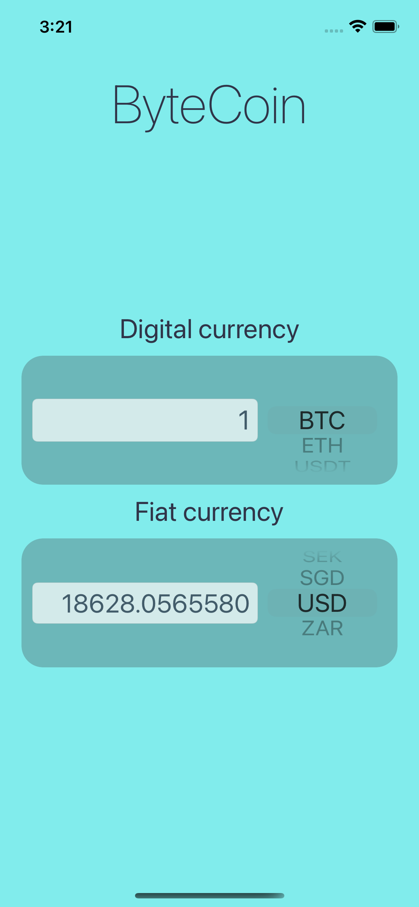
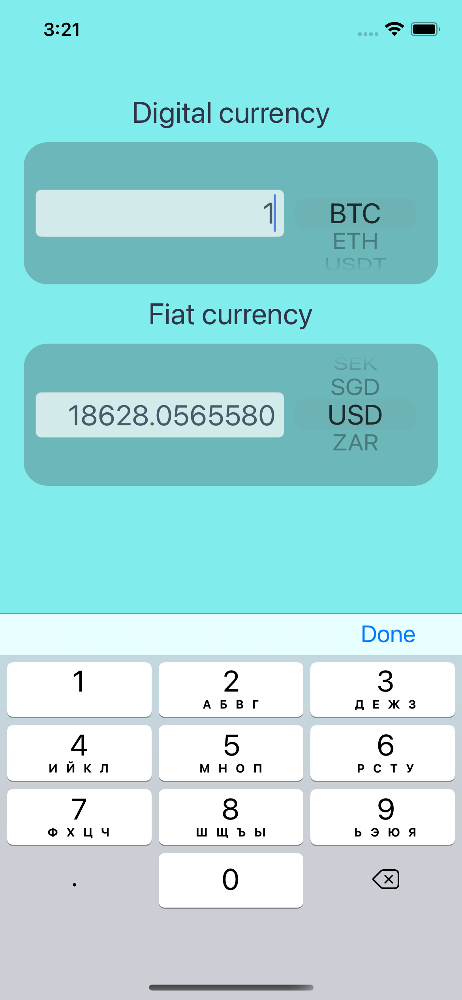
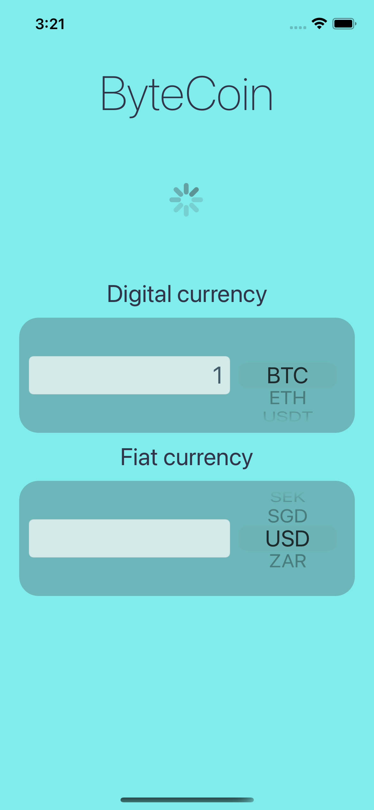
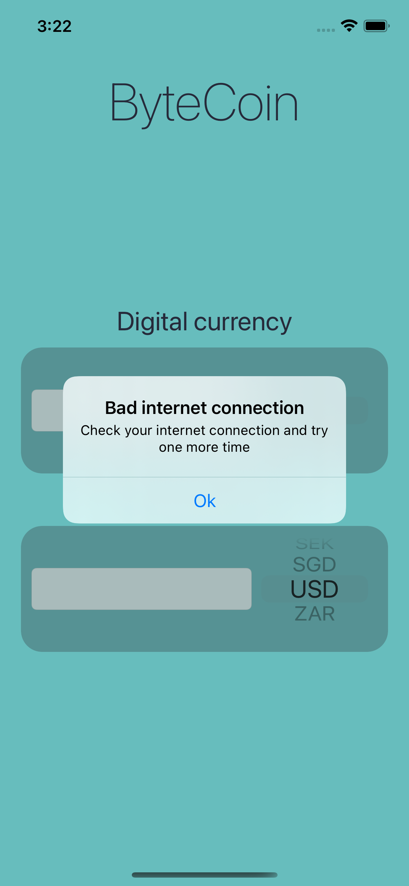
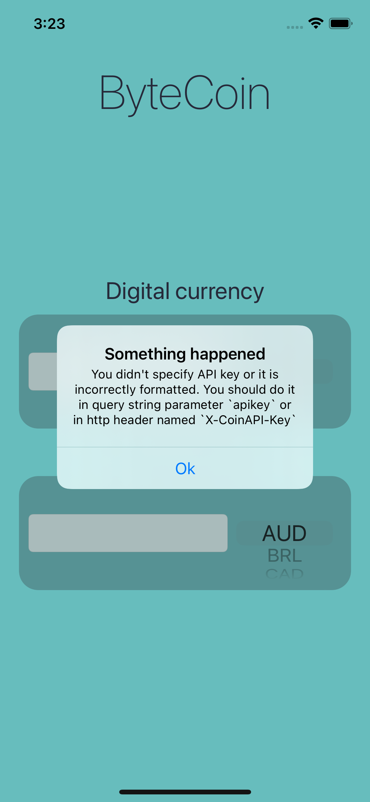

## About the app
This app was made in learning purpose and it's based on the app ByteCoin from Angela Yu [iOS bootcamp](https://www.udemy.com/course/ios-13-app-development-bootcamp/). It can convert digital currency to fiat currency and back using [coinapi](http://coinapi.io).

## I practiсed
- The delegate pattern to send data and errors to the View Controller
- Error handling
- Network asynch requests
- Working with bad intenet connection
- Delaying requests with timers
- UX logic
- Animating a view to present a keyboard

## App in action


## Images
<p float="left">
  
   
  
  
  
</p>

## Test this app
To test this app add your api-key from [coinapi](http://coinapi.io) to here:
```Swift
CoinNetworkManager.swift

final class CoinNetworkManager {
// ...
    private let apiKey = "ENTER YOUR API KEY HERE"
// ...
```
